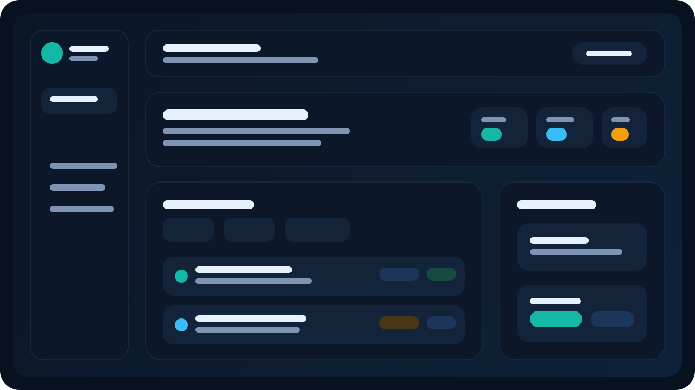
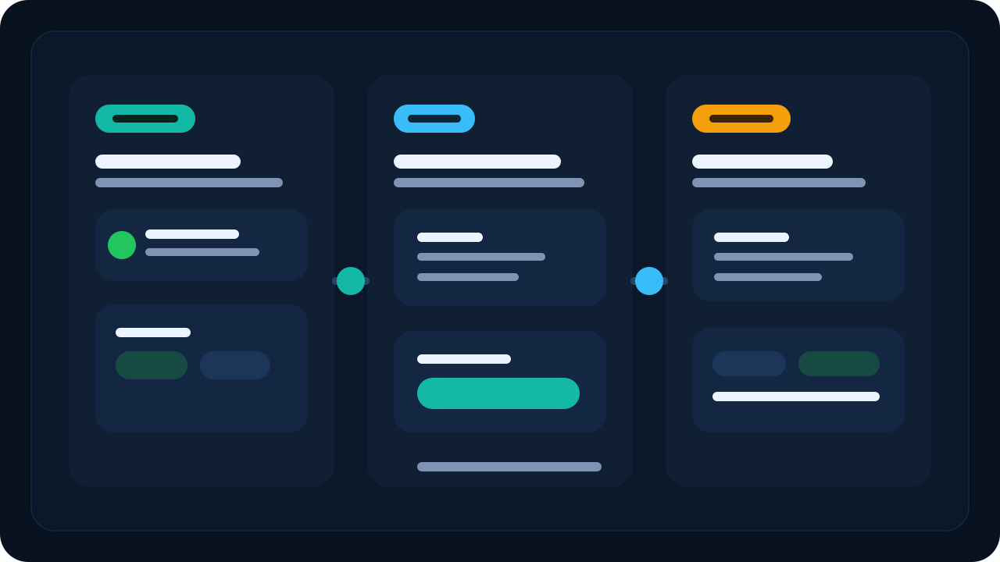

# PulseBoard Todo App

PulseBoard is a modernized todo app with role-based access, a more polished dashboard, and persistent database storage for long-running use. ✨





## What Changed 🚀

- modernized UI for a more professional look
- `admin` and regular `user` roles
- login and registration
- richer tasks with priority, category, due date, and notes
- dedicated persistent database directory for safer Docker and Portainer deployments

## Database Persistence 💾

The app now stores its runtime database in a dedicated data path:

- local default: `./data/todos.db`
- container default: `/app/data/todos.db`

If an older root-level `todos.db` already exists, the server copies it into the new data directory automatically on first start so existing data is not lost.

## Docker Compose 🐳

Start the app on port `3060`:

```bash
docker compose up -d --build
```

Open:

- http://localhost:3060

The compose file uses a named volume so your data survives restarts and redeployments:

- `todoappv4-data`

Stop and remove the local container when you are done:

```bash
docker compose down
```

If you also want to remove the persistent Docker volume, run:

```bash
docker compose down -v
```

## Portainer Deployment Via Git 🔗

This repository is ready to deploy as a Portainer stack from Git.

1. Push this repository to GitHub.
2. Open Portainer.
3. Go to `Stacks`.
4. Choose `Add stack`.
5. Select the Git repository deployment option.
6. Point Portainer to this repository.
7. Use `docker-compose.yml` as the compose path.
8. Deploy the stack.

The app will be published on:

- `http://your-server:3060`

Persistent task data will stay in the Docker volume:

- `todoappv4-data`

## Manual Docker Run ⚙️

```bash
docker build -t ferns1992/todoappv4:latest .
docker run -d \
  --name todoappv4 \
  -p 3060:3060 \
  -e PORT=3060 \
  -e DB_DIR=/app/data \
  -v todoappv4-data:/app/data \
  --restart unless-stopped \
  ferns1992/todoappv4:latest
```

## Local Development 💻

```bash
npm install
node server.js
```

Open:

- http://localhost:3060

## Seed Accounts 🔐

The app creates these starter accounts automatically:

- admin role: `admin` / `admin123`
- user role: `demo` / `demo123`

## Notes 📝

- session tokens are in-memory and reset when the server restarts
- task data is persisted to disk
- task creation returns the newly created todo correctly in local and Docker deployments
- `node_modules` and runtime database files are excluded from git going forward
